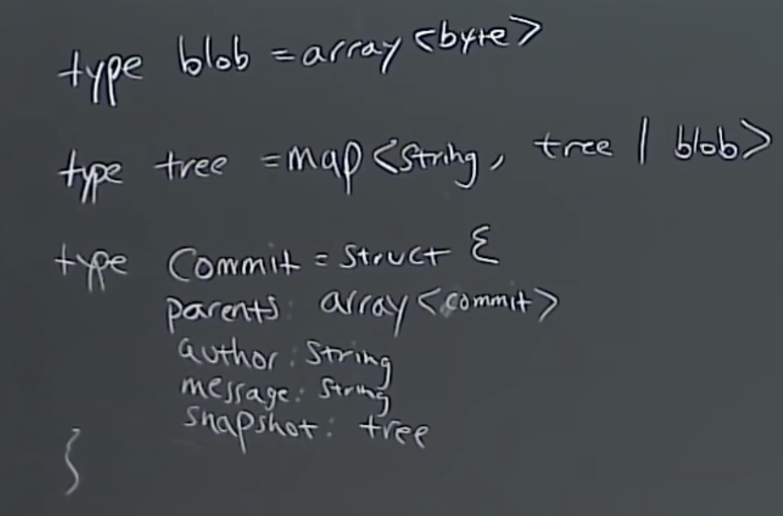
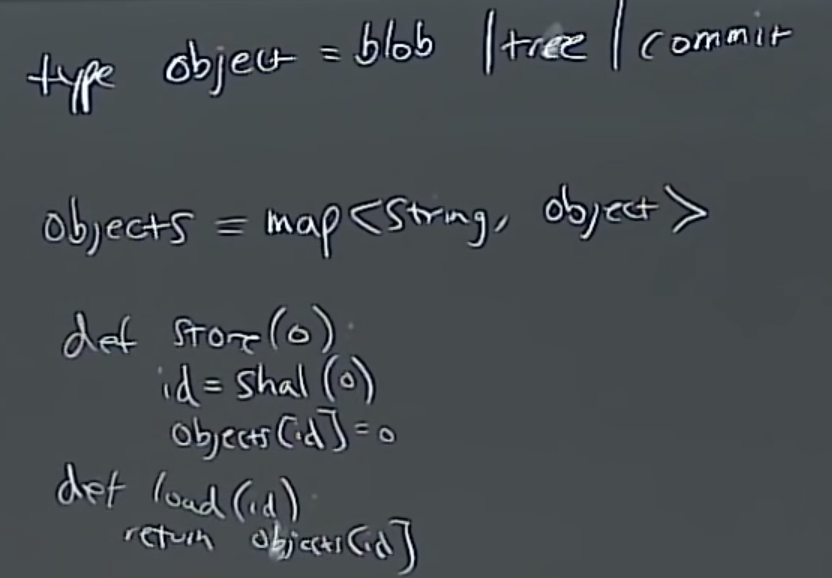

# L6. Version Control \(Git\)

## Git’s data model



It’s a clean, simple model of history.

```text
// a file is a bunch of bytes
type blob = array<byte>

// a directory contains named files and directories
type tree = map<string, tree | blob>

// a commit has parents, metadata, and the top-level tree
type commit = struct {
    parent: array<commit>
    author: string
    message: string
    snapshot: tree
}
```


### Objects and content-addressing <a id="objects-and-content-addressing"></a>



An “object” is a blob, tree, or commit:

```text
type object = blob | tree | commit
```

In Git data store, all objects are content-addressed by their [SHA-1 hash](https://en.wikipedia.org/wiki/SHA-1).

```text
objects = map<string, object>

def store(object):
    id = sha1(object)
    objects[id] = object

def load(id):
    return objects[id]
```

Blobs, trees, and commits are unified in this way: they are all objects. When they reference other objects, they don’t actually _contain_ them in their on-disk representation, but have a reference to them by their hash.

### References <a id="references"></a>

Now, all snapshots can be identified by their SHA-1 hash. That’s inconvenient, because humans aren’t good at remembering strings of 40 hexadecimal characters.

Git’s solution to this problem is human-readable names for SHA-1 hashes, called “references”.

References are pointers to commits. Unlike objects, which are immutable, references are mutable \(can be updated to point to a new commit\). For example, the `master` reference usually points to the latest commit in the main branch of development.

```text
references = map<string, string>

def update_reference(name, id):
    references[name] = id

def read_reference(name):
    return references[name]

def load_reference(name_or_id):
    if name_or_id in references:
        return load(references[name_or_id])
    else:
        return load(name_or_id)
```

### Repositories <a id="repositories"></a>

Finally, we can define what \(roughly\) is a Git _repository_: it is the data `objects` and `references`.


## Git command-line interface <a id="git-command-line-interface"></a>


To avoid duplicating information, we’re not going to explain the commands below in detail. See the highly recommended [Pro Git](https://git-scm.com/book/en/v2) for more information, or watch the lecture video.

### Basics <a id="basics"></a>

* `git help <command>`: get help for a git command
* `git init`: creates a new git repo, with data stored in the `.git` directory
* `git status`: tells you what’s going on
* `git add <filename>`: adds files to staging area
* `git commit`: creates a new commit
  * Write [good commit messages](https://tbaggery.com/2008/04/19/a-note-about-git-commit-messages.html)!
  * Even more reasons to write [good commit messages](https://chris.beams.io/posts/git-commit/)!
* `git log`: shows a flattened log of history
* **`git log --all --graph --decorate`**: visualizes history as a DAG
* `git diff <filename>`: show changes you made relative to the staging area
* `git diff <revision> <filename>`: shows differences in a file between snapshots and current local version
* `git diff <revision1> <revision2> <filename>`: shows differences in a file between snapshots
* `git checkout <revision>`: updates HEAD and current branch


### Branching and merging <a id="branching-and-merging"></a>

* `git branch`: shows branches
* `git branch <name>`: creates a branch
* `git checkout -b <name>`: creates a branch and switches to it
  * same as `git branch <name>; git checkout <name>`
* `git merge <revision>`: merges into current branch
* `git mergetool`: use a fancy tool to help resolve merge conflicts
* `git rebase`: rebase set of patches onto a new base

### Remotes <a id="remotes"></a>

* `git remote`: list remotes
* `git remote add <name> <url>`: add a remote
* `git push <remote> <local branch>:<remote branch>`: send objects to remote, and update remote reference
* `git branch --set-upstream-to=<remote>/<remote branch>`: set up correspondence between local and remote branch
* `git fetch`: retrieve objects/references from a remote
* `git pull`: same as `git fetch; git merge`
* `git clone`: download repository from remote

### Undo <a id="undo"></a>

* `git commit --amend`: edit a commit’s contents/message
* `git reset HEAD <file>`: unstage a file
* `git checkout -- <file>`: discard changes

## Advanced Git <a id="advanced-git"></a>

* `git config`: Git is [highly customizable](https://git-scm.com/docs/git-config)
* `git clone --depth=1`: shallow clone, without entire version history
* `git add -p`: interactive staging
* `git rebase -i`: interactive rebasing
* `git blame`: show who last edited which line
* `git stash`: temporarily remove modifications to working directory
* `git bisect`: binary search history \(e.g. for regressions\)
* `.gitignore`: [specify](https://git-scm.com/docs/gitignore) intentionally untracked files to ignore

